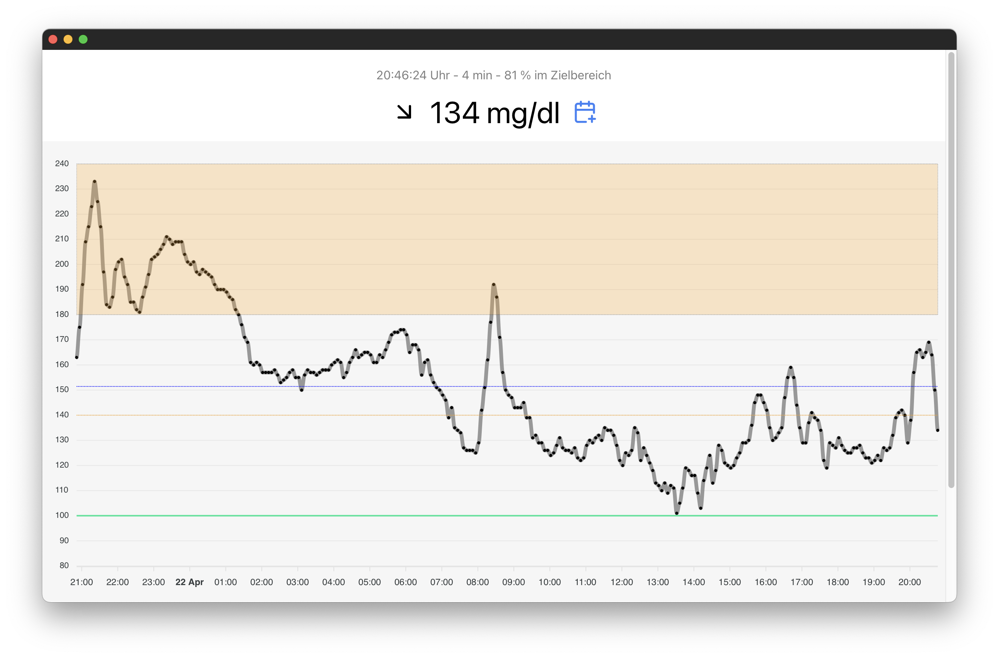

# Sweet Health

**Simple CGM Monitor: A Glucose Tracking Solution for Diabetes Management and Personal Optimization.**



### Supported Sensors

- [Dexcom G7](https://www.dexcom.com)
- [Abbott FreeStyle Libre](https://www.freestylelibre.com)

### Usage

```
npm install
npm start
```

Open http://localhost:8080 and go to "admin" in the lower right corner to set up your person. Data will be saved into `data/health.sqlite`.

### Motivation

- Maintaining control over personal data.
- Access to data over a period of more than 90 days.
- Use of an independent, open data format.
- Possibility to carry out your own analyses.
- Flexibility in the further use of the data.

---

> [!WARNING]
> This project is not actively maintained and no support is available. But hopefully it will be useful for other developers as a starting point.
